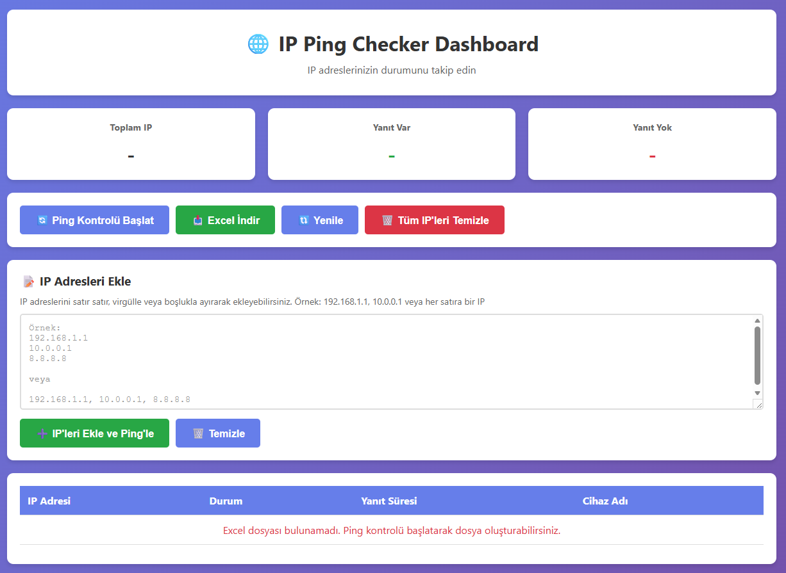

# 🌐 IP Ping Checker - Web Dashboard

[](https://www.python.org/)
[](https://flask.palletsprojects.com/)
[](https://www.docker.com/)
[](LICENSE)

Modern web arayüzü ile IP adreslerini toplu olarak pingleyen, sonuçları görselleştiren ve Excel'e kaydeden profesyonel bir araç.

## ✨ Özellikler

- 🌐 **Web Dashboard**: Modern ve kullanıcı dostu web arayüzü
- 📊 **Toplu IP Ekleme**: IP adreslerini toplu olarak ekleyip otomatik pingleyin
- 📈 **Gerçek Zamanlı İstatistikler**: Yanıt veren/vermeyen IP sayıları
- 📥 **Excel Export**: Sonuçları Excel formatında indirin
- 🔄 **Otomatik Zamanlama**: Haftalık/günlük otomatik ping kontrolü
- 🐳 **Docker Desteği**: Kolay kurulum ve çalıştırma
- 📱 **Responsive Tasarım**: Mobil ve masaüstü uyumlu

## 🚀 Hızlı Başlangıç

### Docker ile Çalıştırma (Önerilen)

```bash
# Repository'yi klonlayın
git clone https://github.com/kullaniciadi/ip-ping-checker.git
cd ip-ping-checker

# Docker Compose ile başlatın
docker-compose up -d

# Web arayüzüne erişin
# http://localhost:5000
```

### Manuel Kurulum

```bash
# Bağımlılıkları yükleyin
pip install -r requirements.txt

# Uygulamayı başlatın
python app.py

# Web arayüzüne erişin
# http://localhost:5000
```

## 📸 Ekran Görüntüleri

### Ana Dashboard


### IP Ekleme


### Ping Sonuçları


## 🎯 Kullanım

### Web Arayüzü Üzerinden

1. **IP Ekleme**: 
   - "IP Adresleri Ekle" bölümüne IP'leri yapıştırın
   - Satır satır veya virgülle ayırarak ekleyebilirsiniz
   - "IP'leri Ekle ve Ping'le" butonuna tıklayın

2. **Ping Kontrolü**:
   - "Ping Kontrolü Başlat" butonu ile manuel kontrol yapın
   - Sonuçlar tabloda görüntülenir

3. **Excel İndirme**:
   - "Excel İndir" butonu ile sonuçları indirin

4. **Temizleme**:
   - "Tüm IP'leri Temizle" butonu ile tüm IP'leri silebilirsiniz

## 📋 API Endpoints

- `GET /` - Ana sayfa
- `GET /api/status` - IP listesi ve istatistikler
- `POST /api/add-ips` - IP adresleri ekle
- `POST /api/ping` - Manuel ping kontrolü
- `GET /api/download` - Excel dosyasını indir
- `POST /api/clear-ips` - Tüm IP'leri temizle

## 🛠️ Teknolojiler

- **Backend**: Python 3.11, Flask 3.0.0
- **Frontend**: HTML5, CSS3, JavaScript (Vanilla)
- **Veri İşleme**: openpyxl (Excel)
- **Zamanlama**: schedule
- **Containerization**: Docker, Docker Compose

## 📁 Proje Yapısı

```
ip-ping-checker/
├── app.py                 # Flask web uygulaması
├── ping_checker.py        # Ping kontrolü modülü
├── scheduler.py           # Zamanlama modülü
├── templates/
│   └── index.html         # Web arayüzü
├── Dockerfile             # Docker image tanımı
├── docker-compose.yml     # Docker Compose yapılandırması
├── requirements.txt       # Python bağımlılıkları
└── README.md             # Bu dosya
```

## 🔧 Yapılandırma

### Environment Variables

- `WORKDIR`: Excel dosyalarının saklanacağı dizin (varsayılan: `/app/data`)
- `EXCEL_FILENAME`: Excel dosya adı (varsayılan: `IP_Ping_Sonuclari.xlsx`)
- `TZ`: Zaman dilimi (varsayılan: `Europe/Istanbul`)

### Docker Compose

`docker-compose.yml` dosyasında port ve volume ayarlarını değiştirebilirsiniz:

```yaml
ports:
  - "5000:5000"  # Web arayüzü portu

volumes:
  - ./data:/app/data    # Excel dosyaları
  - ./logs:/app/logs    # Log dosyaları
```

## 📝 Lisans

Bu proje MIT lisansı altında lisanslanmıştır.

## 🤝 Katkıda Bulunma

Katkılarınızı bekliyoruz! Lütfen:

1. Fork edin
2. Feature branch oluşturun (`git checkout -b feature/amazing-feature`)
3. Değişikliklerinizi commit edin (`git commit -m 'Add amazing feature'`)
4. Branch'inizi push edin (`git push origin feature/amazing-feature`)
5. Pull Request oluşturun

## 📞 İletişim

Sorularınız için issue açabilirsiniz.

## ⭐ Yıldız Verin

Bu projeyi beğendiyseniz yıldız vermeyi unutmayın! ⭐

---

**Not**: Bu proje eğitim ve test amaçlıdır. Üretim ortamında kullanmadan önce güvenlik kontrollerini yapın.

